# Whaleal-data用户操作手册

## Whaleal-data简介

​	归档平台是一款针对数据的归档软件，归档类型分为冷、热、S3，其中热数据归档支持MYSQL、Oracle、DB2、MongoDB同步数据到MongoDB，MYSQL数据同步到MYSQL。冷数据归档支持MongoDB归档至磁盘文件。S3归档支持MongoDB Gridfs类型上传至目标S3。首页显示任务执行统计、归档容量统计、表作业统计、业务接入数、归档总容量及用户操作。平台可自主配置数据源及目标源在表作业中选择某源端同步至某目标端。表作业配置完成后可在任务配置处配置多个表作业在一个任务中。任务创建完成后在任务调度处可开启作业、禁用作业、立即执行、下线作业，立即执行后可在任务监控处查看对应的任务执行情况。管理员用户可查看各种操作详情等。

## Whaleal-data安装部署

### 	架构图

###     安装要求

#### 		硬件要求

​	操作系统：Windows 10 或更高版本、Linux 发行版（如Ubuntu、CentOS）、MacOS。

​	处理器：Intel Core i5 或更高级别的处理器。

​	内存：至少 8GB RAM。

​	存储空间：至少 100GB 的可用磁盘空间。

​	网络适配器：支持有线或无线连接的网络适配器。

#### 		网络要求

##### 				网络访问要求

​	根据自身需求配置。

##### 				端口要求

​	需要开放指定的端口（如 80 端口用于 HTTP 通信，程序启动所用端口）。

#### 		软件要求      

##### 				操作系统要求

​	支持 Windows Server 2016 或更高版本。

##### 				浏览器支持

​	Google Chrome 版本 80 或更高、Mozilla Firefox 版本 75 或更高。

### 	服务器高可用部署

​	将服务在多个机器进行部署使用负载均衡器将流量分发到多个服务器上，以实现请求的平衡和分担。常见的负载均衡算法包括轮询、最少连接和哈希算法等。在系统中使用多个相同配置的服务器，以便在一个服务器发生故障时，其他服务器可以接管其工作并保持系统的连续性。常见的冗余备份模式包括主备模式、活动-活动模式和N+1模式等。

### 	docker容器快速部署

​	进入docker-compose.yml同级目录，使用 `docker-compose up -d`启动。

​	docker服务启动成功后，可通过`docker logs -f root_whaleal-data_1`命令查看whaleal-data服务运行日志。本地服务器需绑定域名解析登录web端，命令：`sudo sh -c 'echo "docker服务器ip  whaleal-data.com" >> /etc/hosts'`

登录whaleal-data服务
`http://docker服务器ip` 或者`http://whaleal-data.com`

首次用户登录
	user:"admin"
	pwd:"123456"
系统强制要求用户修改密码后登录

Tips:
	冷数据归档：
		冷数据归档默认填写路径为/whalealdb。docker服务映射外部路径为/opt/whalealdb。

### 	 快速访问

​	docker容器化启动whaleal-data服务。该服务依赖于`mysql`,`mongodb`,`redis`,`zookeeper`服务启动，通过`nginx`服务代理转发在本地浏览器中运行。

## whaleal-data使用手册

### 	登录页面

#### 		用户首次登录

​	系统初始化设置管理员账号为admin，密码为123456。第一次登录时将提示用户修改密码。首次登录修改密码后重新进行登录即可。

#### 		用户注册

​	平台支持自主注册账号功能，用户注册后管理员用户可对新用户进行资源权限的分配。

### 	首页展示

​	首页显示任务执行统计、归档容量统计、表作业统计、业务接入数、归档总容量及用户操作的滚动播放，上方时间处可自定义选择某时间段内的数据展示。

#### 		任务执行统计

​	任务执行统计饼状图显示了在某时间范围内任务执行结果的种类的占比图。其任务执行状态分别有running（正在执行）、successed（成功完成）、failed（执行失败）、other（其余类型）。

#### 		归档容量统计

​	归档容量统计展示了各数据源类型同步到目标源类型的总大小，第一列为数据源类型第二列为目标源类型，其数据源四种类型都可同步到目标端MongoDB，但数据源为MYSQL时只能同步到MYSQL类型的目标源。第三列为冷数据目标端文件与目标端S3，其只有数据源为MongoDB时才可以归档之ceph，只有源数据为MongoDB Gridfs数据时才可同步到目标S3处。

#### 		用户操作统计

​	用户操作统计滚动展示了某个用户在某时间做了什么事，一些登录操作及任务执行等都将在此进行展示。

#### 		表作业统计

​	表作业统计展示了此时间端内各类表作业数量的折线图，方便用户观察近期任务执行趋势。也可选择下拉框内的作业类型进行展示不同类型数据源的折线图。

#### 		业务接入（源个数）

​	业务接入（源个数）指当前平台在此时间段内数据源接入的数量，将次绘制成折线图方便观察近期数据源的增长趋势。同样可选择数据源类型。

#### 		归档总量

​	归档总容量绘制了当前时间段内本平台总体归档了多大的数据量，使用折线图方便用户观察近期归档总量的增长趋势。

### 	配置管理

#### 		数据源管理

##### 			新增数据源

​	数据源新增，点击配置管理下的数据源管理即可查看平台内所有数据源信息。点击第一张图中“新增”按钮弹出第二张图所示表单，即可新增数据源信息；数据源可选MongoDB、MYSQL、Oracle、DB2。连接数据库所用的用户名和密码需要自行输入，option为可选项填项配置相关数据库的某些连接方式等。点击“测试”按钮可验证用户信息是否能连接数据库。之后点击确认保存数据源。

##### 			修改数据源

​	点击右侧操作栏中蓝色按钮，出现编辑数据源表格与新增类似修改过后点击测试，出现测试通过完成后点击确认即可修改完成。

##### 			删除数据源

​	点击右侧操作栏中红色按钮，出现删除提示，若需删除点击确定即可若误点可点击取消按钮。

##### 			绑定数据源用户

​	点击系统管理下的用户管理即可显示所有用户信息，点击需要操作的用户后勾选右侧需要添加的数据源后进行保存即可将数据源绑定至用户。

#### 		目标源管理

##### 			新增温/冷/S3数据目标源

​	目标源新增，点击配置管理下的目标源配置即可查看平台内所有目标源信息。若想添加温数据目标源点击上方的"温数据目标源"，若想添加冷数据目标源点击"冷数据文件源"，同理S3类型目标源添加需点击"S3"。之后点击新增按钮弹出新增页面冷数据与S3操作与数据源新增类似，测试完成后点击确认即可保存，冷数据文件源填写完成后点击确认即可保存。

##### 			修改温/冷/S3数据目标源

​	修改目标源点击蓝色按钮跳出编辑页面，温数据目标源与S3操作与数据源修改相同，冷数据文件源修改路径后点击确定即可。

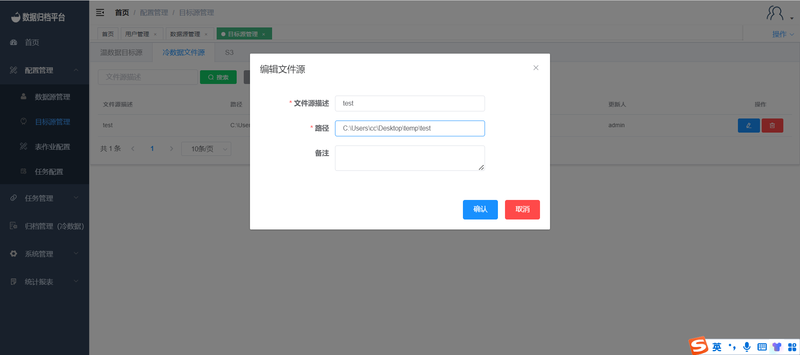

##### 			删除温/冷/S3数据目标源

​	修改目标源点击红色按钮后弹出提示框，若确定删除点击确认即可，若不想删除点击取消即可。

##### 			绑定温/冷/S3数据目标源用户

​	绑定目标源操作与绑定数据源相同，若要绑定目标源点击目标源后勾选目标源，文件源与S3同理。之后点击保存后此用户已有此源的权限。

#### 		表作业配置

##### 			新增温/冷/S3作业

​	点击配置管理下的表作业配置,点击温数据表作业可查看平台内所有温数据表作业信息，点击冷数据表作业配置可查看平台内所有冷数据表作业信息，点击S3表作业配置可查看平台内所有S3表作业信息。同理新增哪种类型的表作业配置需在哪点击新增。之后跳出第二张图片表格，选择完数据源与目标源后可选择一致性校验、归档方式、同步完数据处理方式等。一致性校验选择是后可填写校验百分比。归档模式为“全量更新”的情况下，无须录入sql条件平台直接归档整表数据，归档模式为“增量更新”的情况下，窗口会多出录入sql条件的输入框及自定义sql配置按钮见第三张图；如想自定义配置sql可点击按钮进入第四张图表格进行数据表字段的可视化条件配置。当数据源与目标源同时为MongoDB时可选择Gridfs，若Gridfs为是则同步MongoDB的Gridfs数据类型。

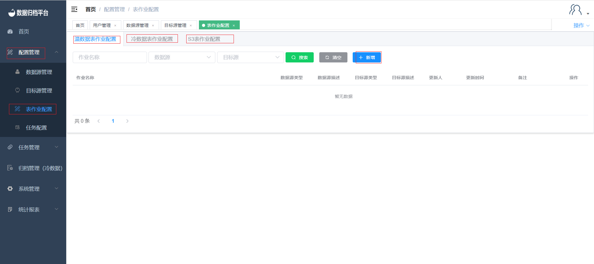

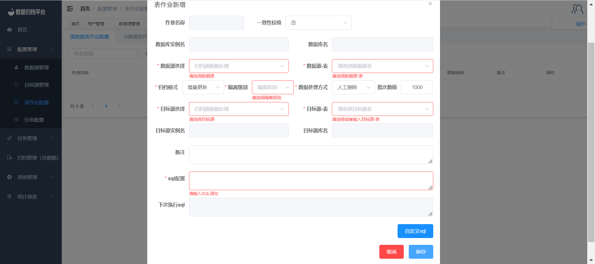

##### 			编辑温/冷/S3作业

​	点击右侧蓝色按钮弹出编辑表格，修改表作业后点击保存即可。

##### 			删除温/冷/S3作业

​	点击右侧红色按钮弹出提示框，若确定删除点击确认即可，若不想删除可点击取消。

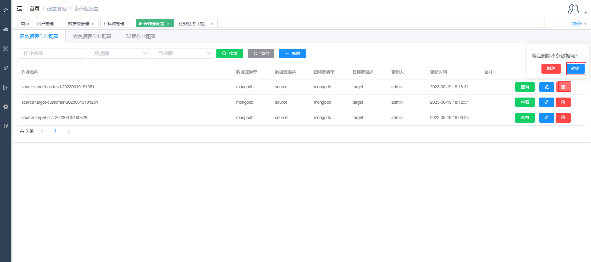

##### 			搜索温/冷/S3作业

​	点击上方搜索按钮并填写前面三个条件框，可过滤出当前平台所有符合条件的表作业配置。

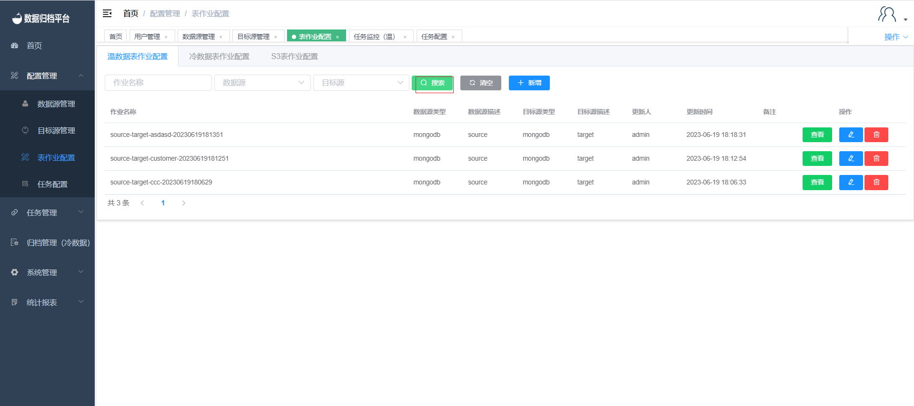

##### 			查看温/冷/S3作业

​	点击右侧查看按钮，弹出白作业配置详情但不可操作。

#### 		任务配置

##### 			新增温/冷/S3任务

​	点击配置管理下的任务配置，点击温数据任务配置可查看平台内所有温数据归档任务信息，点击冷数据任务配置可查看平台内所有冷数据归档任务信息，点击S3任务配置可查看平台内所有S3归档任务信息。之后在需添加的任务类型配置处点击新增按钮弹出第二张图所示表格。点击添加作业后弹出已配置完成的表作业配置可在任务配置处配置多个表作业在一个任务中如第三张图所示点击确定后将表作业关联至任务配置。任务可分为手工任务、循环任务、单次任务，单次任务可使用Cron表达式设置执行时间，循环任务则必须设置Cron表达式设置循环执行时间。由于一个任务可以有多个表作业，所以在任务配置处可配置执行模式是串行或并行。在任务配置处可配置任务超时时间，也可配置失败重试次数，及任务失败或成功后的提示信息发送邮件至邮箱。配置完成如第四张图后点击确认即可。配置完成后需管理用户进行审核。

##### 			编辑温/冷/S3任务

​	点击编辑按钮后弹出第一张图所示表格，在审核完成前此任务配置可编辑可删除，但管理用户审核过后不可编辑并不可删除。任务编辑后点击确认即可。

##### 			删除温/冷/S3任务

​	在管理用户审核完成前可编辑可删除，点击红色删除按钮后弹出提示框，若确认删除点击删除即可，若不想删除点击取消即可。

​	

##### 			搜索温/冷/S3任务

​	在搜索按钮前有两个条件框，填写完成后点击搜索可过滤出符合条件的任务配置。

### 	任务管理

#### 		任务调度

​	点击任务管理下的任务调度，该页面展示了已通过审核的任务，搜索按钮前的条件框可根据所需填写条件点击搜索过滤出任务。针对单条任务可对其进行状态的修改，例如作业进行开启、禁用、下线、立即执行。

##### 				开启作业

​	作业被禁用后不可再执行任务，可点击任务右侧的作业开启将禁用的任务开启，之后可点击立即执行进行任务的执行，或到达定时时间后自动执行。

##### 				作业禁用 

​	可点击任务右侧的灰色按钮将其禁用，禁用后次任务无法执行，点击开启作业后任务才可正常执行。

##### 				立即执行

​	任务右侧的第三个按钮立即执行，若全量任务点击后会讲次任务立即开始执行同步任务，若为增量任务点击立即执行将执行未到时间的下次执行任务。

##### 				作业下线xx

​	最右侧按钮作业下线点击后将弹出提示框确认是否下线，因下线后不可恢复同时次任务将不可再用。若确认下线点击下线即可，若不下线点击取消。

#### 		任务监控（温）

##### 				作业状态 

​	点击任务管理下的任务监控（温），该页面展示了针对温作业的任务执行状态信息，其中有已完成的任务、进行中的任务、异常任务，每个搜索按钮前都有条件框，可在任务较多不便观察某任务时进行过滤展示。

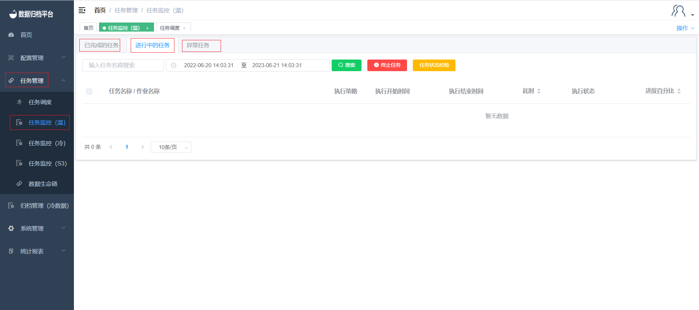

##### 					已完成任务

​	点击已完成的任务，此页面展示了正常完成的任务的一些信息，其中有对应任务的执行策略、执行开始时间、执行结束时间、耗时、执行状态、进度百分比、已归档条数、源表数据状态、执行sql。并且在上方有四个按钮，搜索、修改源表数据状态、人工删除源表数据、刷新。

**搜索**

​	上方绿色按钮为搜索按钮，前方的条件框输出条件后点击搜索可展示过滤后的已完成任务。

**修改原表数据状态**

​	同步完成后若已手动删除源表数据，可点击黄色按钮修改源表数据为已处理。									

**人工删除原表数据**

​	红色按钮为人工删除源表数据，若表作业配置中没有配置自动删除，若想在同步完成后删除源端表可手动去数据库删除，或选择完任务后点人工删除源表数据。

**刷新**

​	任务的进度百分比为3S更新一次，因此进度条展示可能不是实时的，点击刷新按钮可更新任务进度百分比的进度条及一些任务的状态。

##### 					进行中任务

​	点击进行中的任务，此页面展示了正在执行归档的任务信息，其任务信息有执行策略、执行开始时间、执行结束时间、耗时、执行状态、进度百分比、已归档条数、执行sql，上方有三个按钮搜索、终止任务、任务状态校验。

**搜索**

​	绿色按钮为搜索按钮，左侧有条件框可按需填写，填写完成过滤条件后点击搜索按钮，将展示所有符合条件的进行中的任务。

**终止任务**

​	红色按钮为终止任务，选择完任务后点击终止任务可将任务直接终止，之后此任务将出现在异常任务中，若正常完成则出现在已完成的任务中。

**任务状态校验**

​	一个任务可包含多个表作业，当一个表作业完成后执行下个表作业，完成后若任务状态迟迟没有更新则可选择任务后点击任务状态校验更新任务状态。

##### 					异常任务

​	点击异常任务，此页面展示了异常任务信息，其异常任务信息包含执行策略、执行开始时间、执行结束时间、耗时、执行状态、异常报错、进度百分比、已归档数据条数、执行sql、回滚状态。此页面包含三个按钮即搜索、回滚、重新执行。

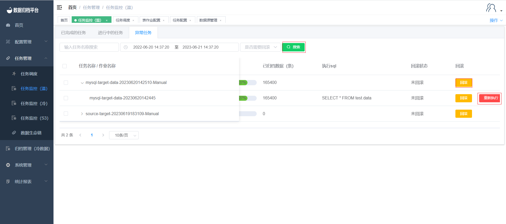

**搜索**

​	上方绿色按钮为搜索按钮，左侧有条件框填写条件后点击搜索可过滤出所需的异常任务。

**回滚**

​	异常任务页面中每个异常任务后方都有回滚按钮，可垫子子任务的回滚按钮将其同步的异常数据回滚掉，若点击父任务的回滚按钮则将此父任务下的子任务全部回滚掉。

**重新执行**

​	异常任务的子任务后方有重新执行按钮，点击重新执行后将自动生成一个父任务，此异常任务与新生成的父任务所绑定，之后进行异常数据的回滚，当回滚完成后此任务与新生成的父任务将出现在正在执行的任务页面中重新执行此任务。

#### 		任务监控（冷）

##### 				作业状态

​	点击任务管理下的任务监控（冷），该页面展示了针对冷作业的任务执行状态信息，其中有已完成的任务、进行中的任务、异常任务，每个搜索按钮前都有条件框，可在任务较多不便观察某任务时进行过滤展示。

##### 					已完成任务

​	点击已完成的任务，此页面展示了正常完成的任务的一些信息，其中有对应任务的执行策略、执行开始时间、执行结束时间、耗时、执行状态、进度百分比、已归档条数、归档路径、源表数据状态、执行sql。并且在上方有四个按钮，搜索、修改源表数据状态、人工删除源表数据、刷新。

**搜索**

​	上方绿色按钮为搜索按钮，前方的条件框输出条件后点击搜索可展示过滤后的已完成任务。

**修改原表数据状态**

​	同步完成后若已手动删除源表数据，可点击黄色按钮修改源表数据为已处理。

**人工删除原表数据**

​	红色按钮为人工删除源表数据，若表作业配置中没有配置自动删除，若想在同步完成后删除源端表可手动去数据库删除，或选择完任务后点人工删除源表数据。

**刷新**

​	任务的进度百分比为3s更新一次，因此进度条展示可能不是实时的，点击刷新按钮可更新任务进度百分比的进度条及一些任务的状态。

##### 					进行中任务

​	点击进行中的任务，此页面展示了正在执行归档的任务信息，其任务信息有执行策略、执行开始时间、执行结束时间、耗时、执行状态、进度百分比、已归档条数、执行sql，上方有三个按钮搜索、终止任务、任务状态校验。

**搜索**

​	绿色按钮为搜索按钮，左侧有条件框可按需填写，填写完成过滤条件后点击搜索按钮，将展示所有符合条件的进行中的任务。

**终止任务**

​	红色按钮为终止任务，选择完任务后点击终止任务可将任务直接终止，之后此任务将出现在异常任务中，若正常完成则出现在已完成的任务中。

**任务状态校验**

​	一个任务可包含多个表作业，当一个表作业完成后执行下个表作业，完成后若任务状态迟迟没有更新则可选择任务后点击任务状态校验更新任务状态。

##### 					异常任务

​	点击异常任务，此页面展示了异常任务信息，其异常任务信息包含执行策略、执行开始时间、执行结束时间、耗时、执行状态、异常报错、进度百分比、已归档数据条数、归档路径、执行sql、回滚状态。此页面包含三个按钮即搜索、回滚、重新执行。

**搜索**

​	上方绿色按钮为搜索按钮，左侧有条件框填写条件后点击搜索可过滤出所需的异常任务。

**回滚**

​	异常任务页面中每个异常任务后方都有回滚按钮，可垫子子任务的回滚按钮将其同步的异常数据回滚掉，若点击父任务的回滚按钮则将此父任务下的子任务全部回滚掉。

**重新执行**

​	异常任务的子任务后方有重新执行按钮，点击重新执行后将自动生成一个父任务，此异常任务与新生成的父任务所绑定，之后进行异常数据的回滚，当回滚完成后此任务与新生成的父任务将出现在正在执行的任务页面中重新执行此任务。

#### 		任务监控（S3）

​	点击任务管理下的任务监控（S3），该页面展示了针对S3作业的任务执行状态信息，其中有已完成的任务、进行中的任务、异常任务，每个搜索按钮前都有条件框，可在任务较多不便观察某任务时进行过滤展示。

##### 			作业状态

##### 					已完成任务

​	点击已完成的任务，此页面展示了正常完成的任务的一些信息，其中有对应任务的执行策略、执行开始时间、执行结束时间、耗时、执行状态、进度百分比、已归档条数、源表数据状态、执行sql。并且在上方有四个按钮，搜索、修改源表数据状态、人工删除源表数据、刷新。

**搜索**

​	上方绿色按钮为搜索按钮，前方的条件框输出条件后点击搜索可展示过滤后的已完成任务。

**修改原表数据状态**

​	同步完成后若已手动删除源表数据，可点击黄色按钮修改源表数据为已处理。

**人工删除原表数据**

​	红色按钮为人工删除源表数据，若表作业配置中没有配置自动删除，若想在同步完成后删除源端表可手动去数据库删除，或选择完任务后点人工删除源表数据。

**刷新**

​	任务的进度百分比为3s更新一次，因此进度条展示可能不是实时的，点击刷新按钮可更新任务进度百分比的进度条及一些任务的状态。

##### 					进行中任务

​	点击进行中的任务，此页面展示了正在执行归档的任务信息，其任务信息有执行策略、执行开始时间、执行结束时间、耗时、执行状态、进度百分比、已归档条数、执行sql，上方有三个按钮搜索、终止任务、任务状态校验。

**搜索**

​	绿色按钮为搜索按钮，左侧有条件框可按需填写，填写完成过滤条件后点击搜索按钮，将展示所有符合条件的进行中的任务。

**终止任务**

​	红色按钮为终止任务，选择完任务后点击终止任务可将任务直接终止，之后此任务将出现在异常任务中，若正常完成则出现在已完成的任务中。

**任务状态校验**

​	一个任务可包含多个表作业，当一个表作业完成后执行下个表作业，完成后若任务状态迟迟没有更新则可选择任务后点击任务状态校验更新任务状态。

##### 					异常任务

​	点击异常任务，此页面展示了异常任务信息，其异常任务信息包含执行策略、执行开始时间、执行结束时间、耗时、执行状态、异常报错、进度百分比、已归档数据条数、执行sql、回滚状态。此页面包含三个按钮即搜索、回滚、重新执行。

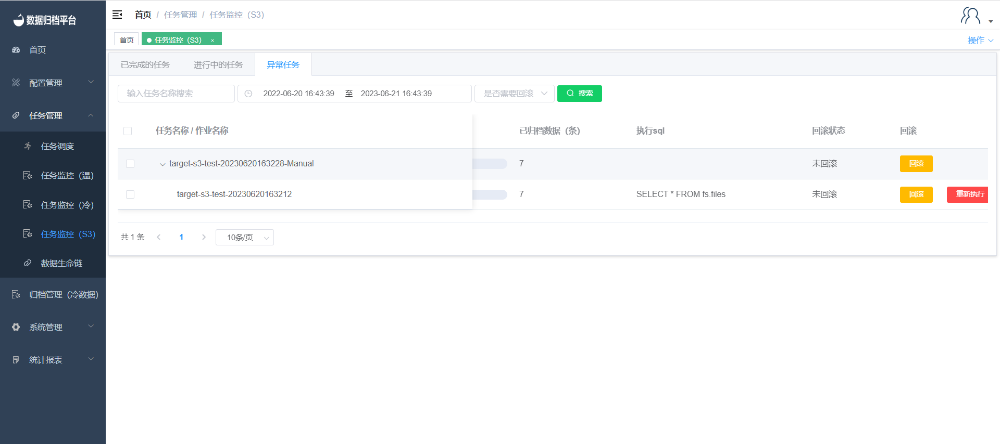

**搜索**

​	上方绿色按钮为搜索按钮，左侧有条件框填写条件后点击搜索可过滤出所需的异常任务。

**回滚**

​	异常任务页面中每个异常任务后方都有回滚按钮，可垫子子任务的回滚按钮将其同步的异常数据回滚掉，若点击父任务的回滚按钮则将此父任务下的子任务全部回滚掉。

**重新执行**

​	异常任务的子任务后方有重新执行按钮，点击重新执行后将自动生成一个父任务，此异常任务与新生成的父任务所绑定，之后进行异常数据的回滚，当回滚完成后此任务与新生成的父任务将出现在正在执行的任务页面中重新执行此任务。

### 	归档管理

#### 		日志查询（冷）

​	点击归档管理菜单下的日志查询（冷），可查询出所有文件归档日志信息，此页面有搜索按钮及搜索的条件框和每个任务的回写按钮；

##### 				搜索

​	上方绿色按钮为搜索按钮，左侧条件框为搜索任务时的条件框，填写条件后点击搜索可过滤出所需的任务。

##### 				文件回写

​	点击任务后方黄色文件回写按钮，弹出页面点击创建会回写任务创建回写任务。

**创建回写任务**		

​	点击创建回写任务按钮弹出一下表单，填写完成后点击确认即可。

**删除临时表**	

​	创建回写任务完成后可任务开始回写，完成后点击删除临时表按钮弹出提示框，若确认删除点击执行即可，日不想删除点击取消。

#### 		文件巡检管理

​	点击归档管理菜单下的文件巡检管理，可查询出所有文件巡检日志信息，点击“创建巡检任务”按钮后可创建文件巡检任务，系统执行相应文件检查校验逻辑，针对异常的文件记录，可以手工更新文件路径或执行重新归档操作。

##### 				搜索

​	上方绿色按钮为搜索按钮，左侧有条件框可进行选填，填写条件后点击搜索按钮即可过滤出所需的巡检。

##### 				创建巡检任务

​	点击蓝色按钮创建巡检任务弹出以下表格，填写后点击去人即可生成对应温数据目标源的巡检数据，完成后点击查看详情即可查看对应巡检内容如第二张图所示。

#### 		文件全文检索

​	点击归档管理菜单下的文件全文检索，可查询出所有文件全文检索日志信息，点击“创建检索任务”按钮后可创建文件全文检索任务，系统执行相应文件全局搜索，针对找到符合的文件记录，可以进行文件回写操作。

##### 				搜索

​	上方绿色按钮为搜索按钮，左侧条件框可选填，填写完条件后点击搜索按钮即可过滤出所需检索内容。

##### 				创建检索任务

​	点击蓝色按钮创建检索任务弹出一下表单，填写后点击确认。

### 	系统管理

#### 		用户管理

​	点击系统管理菜单下的用户管理，此页面只有管理员用户可见，页面展示出平台所有的用户信息及数据库权限绑定等。

##### 				搜索

​	绿色按钮为搜索按钮，左侧两个条件框，填写完条件后点击搜索可过滤出所需的用户信息。

##### 				新增用户

​	第二个蓝色按钮为新增按钮，点击“新增”按钮弹出如图界面，填写用户名、邮箱、电话、密码即可新增用户，角色中可选择用户的系统权限及新增的用户状态是否可用。

##### 				导出用户

​	第三个黄色按钮为导出用户按钮，点击后将生成一份所有用户的xlsx文件，文件名称可自定义。

##### 				修改内容

​	点击用户右侧的铅笔按钮即修改用户信息，弹出一下编辑页面。除密码不可修改外其余信息可根据需求按要求修改，修改完成后点击确认即可。

##### 				修改密码

​	点击用户右侧第二个密码按钮，弹出以下图中表格。按需按要求修改完成后点击确认即可保存新密码。

##### 				删除用户

​	点击用户右侧第三个红色按钮弹出确认框，是否删除此用户。若确认删除点击确认即可，若不想删除点击取消即可。

##### 				数据库权限（数据源、目标源、文件源、S3）

​	点击用户后右侧数据库权限为点击用户所绑定的源，其中包括数据源、目标源、文件源、S3，勾选用户所需的源后点击保存即可。

#### 		角色管理

​	点击系统管理菜单下的角色管理，此页面只有管理员用户可见，页面可以查看平台中所有角色权限分类信息。

##### 				搜索

​	上方绿色按钮为搜索按钮，左侧两个条件框填写后点击搜索可过滤出所需的角色列表。

##### 				新增

​	蓝色为新增按钮，点击“新增”按钮弹出如图界面，填写角色名称，角色权限即可新增角色信息。

##### 				修改

​	点击角色右侧的蓝色铅笔图案按钮，弹出编辑角色框，可自行修改角色的名称及权限或添加描述，完成后点击保存即可。

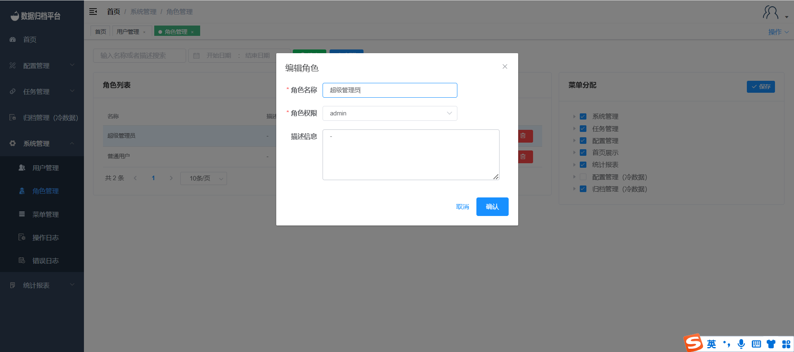

##### 				删除

​	右侧红色按钮为删除按钮，点击删除按钮后弹出提示是否确认删除，若确认删除点击确认即可，若不删除点击取消按钮。

##### 				菜单分配

​	点击用户后右侧菜单分配根据角色实际可操作的权限菜单进行勾选分配并保存数据即可绑定此角色所能操作的菜单。

#### 		菜单管理

​	点击系统管理菜单下的菜单管理，此页面只有管理员用户可见，页面可以查看平台中所菜单的信息，可搜索、新增、修改、删除。

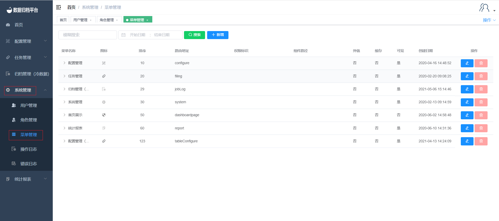

##### 				搜索

​	上方绿色按钮为搜索按钮，左侧两个条件框填写条件后点击搜索即可过滤出想要的菜单。

##### 				新增

​	蓝色按钮为新增按钮，弹出下图表单，可自定义菜单类型、菜单图标、外链菜单、菜单是否可见、菜单标题、路由地址、菜单排序、上级目录等。完成配置后点击确认即可保存。

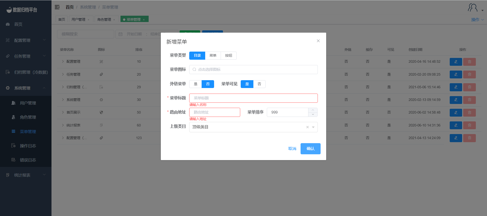

##### 				修改

​	点击菜单名称右侧的蓝色铅笔按钮，弹出编辑表单可根据需求配置。完成后点击确认即可。

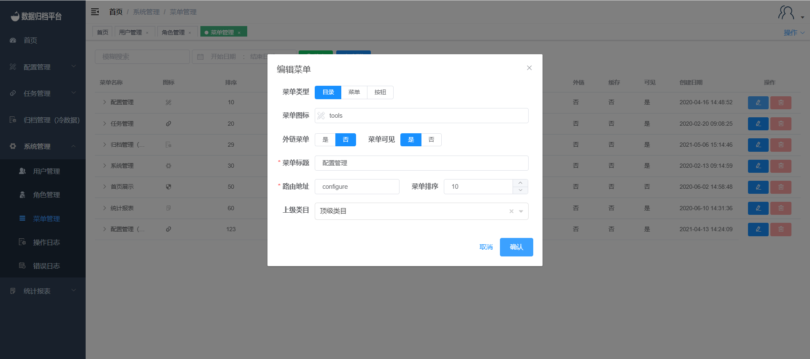

##### 				删除

​	菜单删除按钮不可用，以防误删可根据需求隐藏。

#### 		系统设置

##### 				SMTP邮件设置

​	点击系统管理菜单下的系统设置，此页面只有管理员用户可见，页面展示了SMTP的配置。填写完基本配置后点击测试连接，若测试通过接收到测试邮件后间出现保存按钮，SMTP配置保存后任务配置的告警都将由此配置的邮箱进行发送告警邮件。

#### 		操作日志

##### 				搜索

​	点击系统管理菜单下的系操作日志，此页面只有管理员用户可见，页面展示了平台用户的一些操作日志，绿色按钮为搜索按钮左侧条件框填写条件后点击搜索可过滤出所需的操作日志。

#### 		错误日志

##### 				搜索

​	点击系统管理菜单下的系操作日志，此页面只有管理员用户可见，页面展示了平台用户的一些操作错误日志，绿色按钮为搜索按钮左侧条件框填写条件后点击搜索可过滤出所需的错误日志，点击右侧的查看详情按钮可查看错误原因。

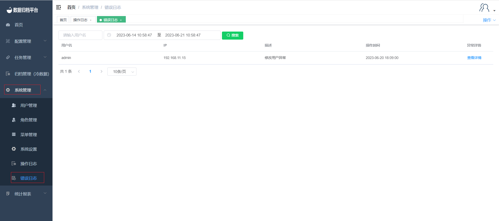

### 	统计报表

#### 		表作业执行统计

​	点击统计报表菜单下的表作业执行统计，可查询出所有表作业的归档信息，此页面有搜索按钮及搜索的条件框和清空条件框按钮与导出按钮；

##### 				搜索	

​	上图绿色按钮为搜索按钮，左侧有两个条件框。填写完过滤条件后点击搜索即可过滤出符合条件的表作业统计。

##### 				清空

​	黑色按钮为清空按钮，即情况条件框的时间。

##### 				导出	

​	黄色按钮为导出按钮可将表作业统计信息导出为xlsx文件。	

##### 			

#### 		异常作业执行统计

​	点击统计报表菜单下的异常作业执行统计，可查询出所有异常表作业的归档信息，此页面有搜索按钮及搜索的条件框和清空条件框按钮与导出按钮；

##### 				搜索	

​	上图绿色按钮为搜索按钮，左侧有一个条件框。填写完过滤条件后点击搜索即可过滤出符合条件的异常表作业统计。

##### 				清空

​	黑色按钮为清空按钮，即情况条件框的时间。

##### 				导出		

​	黄色按钮为导出按钮可将异常表作业统计信息导出为xlsx文件。

#### 		系统接入统计

​	点击统计报表菜单下的系统接入统计，可查询出所有接入本平台的业务，此页面有搜索按钮及搜索的条件框和清空条件框按钮与导出按钮；

##### 				搜索	

​	上图绿色按钮为搜索按钮，左侧有两个条件框。填写完过滤条件后点击搜索即可过滤出符合条件的接入信息。

##### 				清空

​	黑色按钮为清空按钮，即情况条件框的时间。

##### 				导出	

​	黄色按钮为导出按钮可将系统接入统计信息导出为xlsx文件。	

##### 				详情	

​	点击每条接入信息后面的详情，弹出此接入信息的详情。

	

#### 		回滚记录统计

​	点击统计报表菜单下的回滚记录统计，可查询出所有回滚的任务，此页面有搜索按钮及搜索的条件框与导出按钮，每条回滚的任务都有其任务名、作业名、归档类型、执行开始结束时间、执行状态、异常报错、进度百分比、已归档的条数、归档路径、执行sql、回滚状态；

##### 				搜索	

​	上图绿色按钮为搜索按钮，左侧有仨个条件框。填写完过滤条件后点击搜索即可过滤出符合条件的回滚记录。

##### 				导出

​	黄色按钮为导出按钮可将回滚记录统计信息导出为xlsx文件。

#### 		作业明细

​	点击统计报表菜单下的作业明细，页面展示本平台的作业明细详情，此页面有搜索按钮及搜索的条件框与导出按钮。

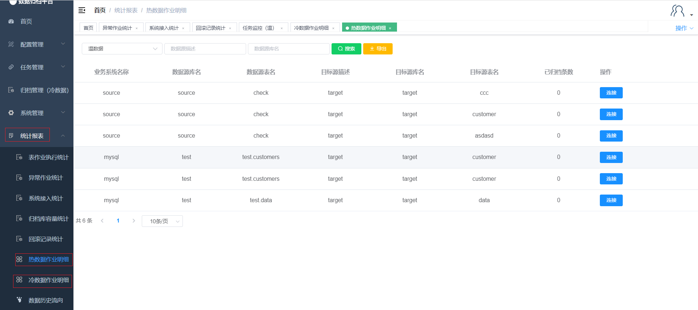

##### 				搜索	

​	上图绿色按钮为搜索按钮，左侧有仨个条件框。填写完过滤条件后点击搜索即可过滤出符合条件的作业明细。

##### 				导出

​	黄色按钮为导出按钮可作业明细统计信息导出为xlsx文件

##### 				连接	

​	每条作业明细后方都有其连接按钮，点击连接按钮后将跳转至此作业的任务监控处。

#### 		数据历史流向

​	点击统计报表菜单下的数据历史流向，页面展示本平台的数据源流向，此页面有搜索按钮及搜索的条件框与清空按钮。

##### 					搜索

​	上图绿色按钮为搜索按钮，左侧有仨个条件框。填写完过滤条件后点击搜索即可过滤出符合条件的数据流向。

​		

## 	use cases

#### 			用户注册

​	进入首页后登录按钮右下方有立即注册按钮，点击立即注册按钮跳转至第二章图所示。填写完注册信息后点击注册即可。

#### 			用户登录

​	输入已注册的账号即可登录，管理员首次登录密码为123456，登录完成后会强制更改密码，其余注册用户权限都为用户级别，管理员用户可分配权限给新用户。

​	

#### 			添加数据源

​	添加数据源点击配置管理菜单下的数据源管理，点击蓝色新增按钮弹出一下表单并填写所添加数据源的基本信息并点击测试，若上方弹出测试通过提示那么点击保存即可新增成功，若测试失败需确认所填信息是否正确。之后点击系统管理下的用户管理，点击所绑定的用户之后在数据源处选定添加的源点击保存后该用户即可使用所添加的数据源。

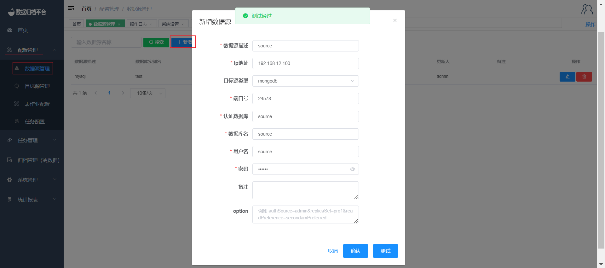

#### 			添加目标源

​	添加目标源点击配置管理菜单下的目标源管理，点击蓝色新增按钮弹出一下表单并填写所添加目标源的基本信息并点击测试，若上方弹出测试通过提示那么点击保存即可新增成功，若测试失败需确认所填信息是否正确。之后点击系统管理下的用户管理，点击所绑定的用户之后在目标源处选定添加的源点击保存后该用户即可使用所添加的目标源。

#### 			添加温数据全量作业

​	点击配置管理菜单下的表作业配置，在温数据表作业页面点击蓝色新增按钮弹出以下表单，自行选择需同步的数据源库表与目标源库表，归档模式选择全量更新。表作业具有一致性校验功能，选择是后可填写所需校验的百分比，同步后平台将对同步的数据进行一致性校验。其中MYSQL相关的作业可选隔离级别，MongoDB同步至MongoDB时可选择是否同步Gridfs，若选择否平台将只同步普通文档。数据处理方式可选人工删除或系统删除，此功能在同步完成后将源表进行按后方批次进行删除。

#### 			添加冷数据全量作业

​	点击配置管理菜单下的表作业配置，在冷数据表作业页面点击蓝色新增按钮弹出以下表单，自行选择需同步的数据源库表与文件源，归档模式选择全量更新。表作业具有一致性校验功能，选择是后可填写所需校验的百分比，同步后平台将对同步的数据进行一致性校验。数据处理方式可选人工删除或系统删除，此功能在同步完成后将源表进行删除。

#### 			添加S3全量作业

​	点击配置管理菜单下的表作业配置，在S3表作业页面点击蓝色新增按钮弹出以下表单，自行选择需同步的数据源库表与目标S3，同步S3时的源端需为MongoDB的Gridfs数据。之后归档模式选择全量更新。表作业具有一致性校验功能，选择是后可填写所需校验的百分比，同步后平台将对同步的数据进行一致性校验，由于S3特性相同文件名称上传将覆盖原有的文件所以同步模式可选择不处理直接替换、最新的文件替换、ID+文件名方式进行同步。数据处理方式可选人工删除或系统删除，此功能在同步完成后将源表进行删除。

#### 			添加温数据增量作业

​	点击配置管理菜单下的表作业配置，在温数据表作业页面点击蓝色新增按钮弹出以下表单，自行选择需同步的数据源库表与目标源库表，归档模式选择增量更新，当归档模式为增量更新时需填写sql配置，可点击蓝色自定义sql按钮弹出第二张图所示表格选择完成条件后点击保存即可生成sql。表作业具有一致性校验功能，选择是后可填写所需校验的百分比，同步后平台将对同步的数据进行一致性校验。其中MYSQL相关的作业可选隔离级别，MongoDB同步至MongoDB时可选择是否同步Gridfs，若选择否平台将只同步普通文档。数据处理方式可选人工删除或系统删除，此功能在同步完成后将源表进行按后方批次进行删除。

#### 			添加冷数据增量作业

​	点击配置管理菜单下的表作业配置，在冷数据表作业页面点击蓝色新增按钮弹出以下表单，自行选择需同步的数据源库表与文件源，归档模式选择增量更新，当归档模式为增量更新时需填写sql配置，可点击蓝色自定义sql按钮弹出第二张图所示表格选择完成条件后点击保存即可生成sql。表作业具有一致性校验功能，选择是后可填写所需校验的百分比，同步后平台将对同步的数据进行一致性校验。其中MYSQL相关的作业可选隔离级别，MongoDB同步至MongoDB时可选择是否同步Gridfs，若选择否平台将只同步普通文档。数据处理方式可选人工删除或系统删除，此功能在同步完成后将源表进行按后方批次进行删除。

#### 			添加S3增量作业

​		点击配置管理菜单下的表作业配置，在S3表作业页面点击蓝色新增按钮弹出以下表单，自行选择需同步的数据源库表与目标S3，同步S3时的源端需为MongoDB的Gridfs数据。之后归档模式选择增量更新。表作业具有一致性校验功能，选择是后可填写所需校验的百分比，同步后平台将对同步的数据进行一致性校验，由于S3特性相同文件名称上传将覆盖原有的文件所以同步模式可选择不处理直接替换、最新的文件替换、ID+文件名方式进行同步。数据处理方式可选人工删除或系统删除，此功能在同步完成后将源表进行删除。

#### 			创建单次任务

​	点击任务配置菜单下的任务配置，此页面展示了所有任务点击蓝色新增按钮弹出第二章图片所示表单。任务模式选择单词任务，之后选择Cron表达式选择执行时间。若此任务表作业很多时可根据自身需求设置执行模式、任务超时时间、失败重试次数。提醒策略选择后添加报警邮箱地址，任务完成后将根据提醒策略发送邮件。点击添加作业弹出第三张图片所示数据配置，勾选作业后县级确定即可讲此作业绑定至新建任务中，最后此任务需管理用户进行审核后才可以执行。

#### 			创建手工任务

​	手工任务与单次任务操作步骤一致，不同的是手工任务无需设置执行时间。若要执行此任务需通过管理员用户审核，之后在任务管理菜单下的任务调度页面找到该任务点击立即执行即可。

#### 			创建循环任务

​	循环任务与单次任务操作步骤一致，循环任务也需设置执行时间此执行时间为下次循环执行的时间。若要执行此任务需通过管理员用户审核，之后在任务管理菜单下的任务调度页面找到该任务点击立即执行即可。

#### 			任务执行监控

​	在任务调度页面点击立即执行或到达任务执行时间后，在任务管理菜单下不同的任务将出现在不同的任务监控处，如温数据将出现在任务监控（温）页面中，页面针对任务状态分为已完成、进行中、异常任务。温、冷、S3页面基本一致在其页面处查看任务的执行状态即可。

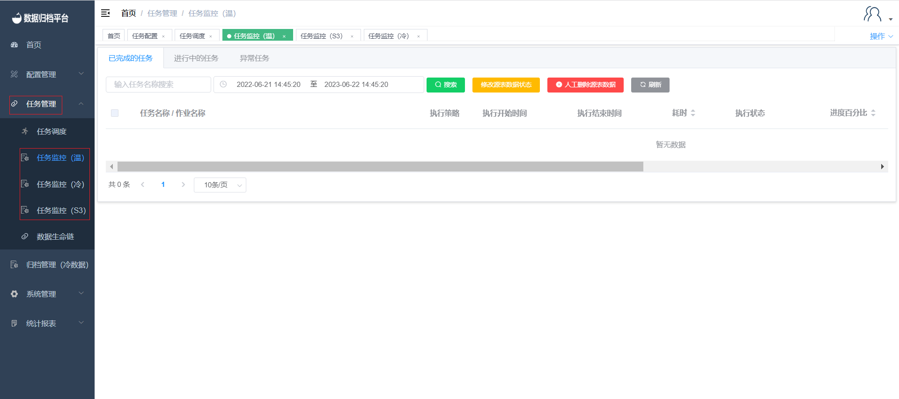

#### 			异常任务回写

​	冷数据归档异常时点击归档管理（冷数据）菜单下的日志查询（冷），在此页面展示了归档冷数据任务，点击文件回写可将已归档的文件回写到数据库中。

#### 			异常任务重新执行

​	在任务管理菜单下有三个任务监控，每个任务监控中都有已完成、进行中、异常。针对异常任务可将此任务单独进行重新执行，点击重新执行后任务将先回滚之后重新执行此任务。

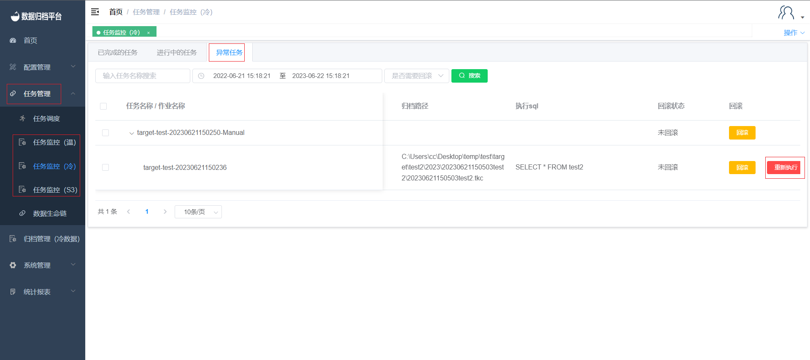

#### 			系统删除源端数据

​	在配置管理菜单下的表作业配置处配置表作业时，表单中有数据处理方式的选择，选择系统删除后跟随后面的批次值数据归档完成后系统将按批次删除源端数据。

​	

#### 			手动删除源端数据

​	在配置管理菜单下的表作业配置处配置表作业时，表单中有数据处理方式的选择，选择人工删除后跟随后面的批次值数据归档完成后源端数据不会被删除，若手动在数据库删除后可在任务监控（冷）处点击修改源表数据状态修改状态，或点击人工删除源表数据进行删除源表。

#### 			冷数据回写

​	冷数据归档异常时点击归档管理（冷数据）菜单下的日志查询（冷），在此页面展示了归档冷数据任务，点击文件回写可将已归档的文件回写到数据库中。

点击任务后方黄色文件回写按钮，弹出页面点击创建会回写任务创建回写任务。

**创建回写任务**		

​	点击创建回写任务按钮弹出一下表单，填写完成后点击确认即可。

#### 			冷数据全文检索

​		点击归档管理菜单下的文件全文检索，可查询出所有文件全文检索日志信息，点击“创建检索任务”按钮后可创建文件全文检索任务，系统执行相应文件全局搜索，针对找到符合的文件记录，可以进行文件回写操作。

##### 				搜索

​	上方绿色按钮为搜索按钮，左侧条件框可选填，填写完条件后点击搜索按钮即可过滤出所需检索内容。

##### 				创建检索任务

​	点击蓝色按钮创建检索任务弹出一下表单，填写后点击确认。

#### 			SMTP配置

##### 				SMTP邮件设置

​	点击系统管理菜单下的系统设置，此页面只有管理员用户可见，页面展示了SMTP的配置。填写完基本配置后点击测试连接，若测试通过接收到测试邮件后间出现保存按钮，SMTP配置保存后任务配置的告警都将由此配置的邮箱进行发送告警邮件。

​				